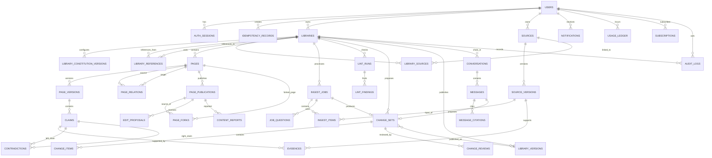

# ZeroWiki ERD 초안

작성일: 2026-07-27  
상태: MVP 논리 설계 초안  
기준 문서: `ZeroWiki-MVP-서비스-기획서.md`

## 1. 설계 목표

이 ERD는 다음 제품 원칙을 데이터 구조로 보장하는 것을 목표로 한다.

1. 사용자가 수집한 원본은 덮어쓰지 않고 버전으로 보존한다.
2. 한 원본을 같은 사용자의 여러 도서관에서 공유할 수 있다.
3. 도서관별 목적과 운영 헌법에 따라 서로 다른 지식 구조를 생성한다.
4. 주장과 근거를 연결해 답변과 모순의 출처를 추적할 수 있어야 한다.
5. AI가 만든 변경은 초안과 검토 단계를 거친 뒤 발행한다.
6. 사용자별 데이터 격리와 명시적인 도서관 간 참조를 강제한다.
7. 비동기 Ingest와 Lint 작업의 상태, 실패, 비용을 추적한다.
8. 공개·포크·과금 기능을 코어 도메인과 느슨하게 결합한다.

## 2. 범위와 우선순위

| 구분 | 포함 영역 |
| --- | --- |
| Phase 1 코어 | 사용자, 도서관, 운영 헌법, 원본, Ingest, 페이지, 주장, 근거, 관계, 모순, 변경 승인, 버전, AI 사서, 검색 |
| Phase 2 | Lint, URL 클리핑, Notion Import, 알림, 처리량과 사용량, 삭제 복구 |
| Phase 3 | 페이지 공개, 포크, 편집 제안, 신고 |
| 후속 확장 | GitHub 미러링, MCP/API 키, 조직 워크스페이스, 실시간 공동 편집 |

물리 DB는 PostgreSQL을 기준으로 하며 기본 키는 `uuid`, 시간은 `timestamptz`, 구조화된 AI 결과와 스냅샷은 제한적으로 `jsonb`를 사용한다.

## 3. 전체 논리 ERD

## 4. 핵심 엔터티

### 4.1 사용자와 인증

#### `users`

| 컬럼 | 타입 | 제약/설명 |
| --- | --- | --- |
| `id` | uuid | PK |
| `email` | citext | UNIQUE, 로그인 식별자 |
| `password_hash` | text | 소셜 로그인 도입 전 비밀번호 해시 |
| `display_name` | varchar(80) | 표시 이름 |
| `locale` | varchar(10) | 기본 `ko-KR` |
| `status` | varchar(20) | `ACTIVE`, `DELETION_PENDING`, `DELETED`, `SUSPENDED` |
| `deletion_requested_at` | timestamptz | 삭제 요청 시각 |
| `purge_scheduled_at` | timestamptz | 완전 삭제 예정 시각 |
| `created_at` | timestamptz | 생성 시각 |
| `updated_at` | timestamptz | 수정 시각 |

#### `auth_sessions`

| 컬럼 | 타입 | 제약/설명 |
| --- | --- | --- |
| `id` | uuid | PK |
| `user_id` | uuid | FK → `users.id` |
| `refresh_token_hash` | text | UNIQUE |
| `expires_at` | timestamptz | 만료 시각 |
| `revoked_at` | timestamptz | 로그아웃·강제 폐기 시각 |
| `ip_hash` | text | 선택적 보안 감사 정보 |
| `user_agent` | text | 선택적 보안 감사 정보 |
| `created_at` | timestamptz | 생성 시각 |

#### `idempotency_records`

생성·명령 작업의 멱등성 키를 저장한다. 24시간 동안 같은 요청에 같은 결과를 반환한다 (API 2.5절, 검증 3.2절, FR-ING-24).

| 컬럼 | 타입 | 제약/설명 |
| --- | --- | --- |
| `id` | uuid | PK |
| `user_id` | uuid | FK → `users.id` |
| `idempotency_key` | varchar(255) | 클라이언트 지정 키 |
| `request_path` | text | 엔드포인트 경로 |
| `request_body_hash` | char(64) | SHA-256 (요청 본문 해시). 같은 키로 다른 본문 재전송 시 409 IDEMPOTENCY_KEY_REUSED |
| `response_status` | integer | 이전 응답 상태 코드 |
| `response_body` | jsonb | 이전 응답 본문 캐시. **서명 URL·다운로드 URL·토큰 등 단기 수명 값은 제외하고 저장한다.** 재요청 시 서버가 해당 필드를 새로 발급해 채운다 (NFR-SEC-09, API 2.5절, API 15절 2번) |
| `created_at` | timestamptz | 생성 시각 |
| `expires_at` | timestamptz | 24시간 후 자동 삭제 대상 |

인덱스:
- UNIQUE(`user_id`, `idempotency_key`)
- `(expires_at)` — 배치 정리용

### 4.2 도서관과 운영 헌법

#### `libraries`

| 컬럼 | 타입 | 제약/설명 |
| --- | --- | --- |
| `id` | uuid | PK |
| `owner_id` | uuid | FK → `users.id` |
| `name` | varchar(120) | 도서관 이름 |
| `description` | text | 설명 |
| `template_type` | varchar(30) | `LEARNING_RESEARCH`, `PERSONAL_DECISION`, `CUSTOM` |
| `visibility` | varchar(20) | MVP 기본 `PRIVATE` |
| `current_constitution_version_id` | uuid | FK → `library_constitution_versions.id`, 순환 FK는 후행 추가 |
| `current_library_version_id` | uuid | FK → `library_versions.id`, 아직 미발행이면 NULL |
| `status` | varchar(20) | `ACTIVE`, `ARCHIVED`, `DELETION_PENDING` |
| `revision` | bigint | 낙관적 잠금용 버전. PATCH/PUT 등 수정 시 증가 (API 2.6절, 검증 3.1절) |
| `created_at` | timestamptz | 생성 시각 |
| `updated_at` | timestamptz | 수정 시각 |

인덱스:

- `(owner_id, status, updated_at DESC)`
- `(owner_id, lower(name))`

#### `library_constitution_versions`

운영 헌법은 수정 시 덮어쓰지 않고 새 버전을 만든다.

| 컬럼 | 타입 | 제약/설명 |
| --- | --- | --- |
| `id` | uuid | PK |
| `library_id` | uuid | FK → `libraries.id` |
| `version_no` | integer | 도서관 내 순번, UNIQUE(`library_id`, `version_no`) |
| `purpose` | text | 목적과 주요 질문 |
| `audience` | text | 예상 독자 |
| `knowledge_level` | varchar(20) | 설명 수준 |
| `source_policy` | jsonb | 출처 우선순위와 신뢰도 기준 |
| `taxonomy_policy` | jsonb | 페이지 유형과 분류 규칙 |
| `link_policy` | jsonb | 자동 연결 범위 |
| `staleness_policy` | jsonb | 분야별 노후화 기준 |
| `risk_policy` | jsonb | 위험 변경 판정 기준 |
| `privacy_policy` | jsonb | 민감정보 처리 규칙 |
| `rejected_patterns` | jsonb | 거절한 연결과 이유의 요약 |
| `natural_language_rules` | text | 사용자에게 보여주는 자연어 규칙 |
| `change_reason` | text | 생성 또는 변경 이유 |
| `created_by_type` | varchar(20) | `ONBOARDING`, `USER`, `FEEDBACK`, `SYSTEM` |
| `revision` | bigint | 낙관적 잠금용 버전. 선택(현재 버전 사용 시에만 증가) (검증 3.1절) |
| `created_at` | timestamptz | 생성 시각 |

#### `library_references`

명시적 단방향 도서관 참조다.

| 컬럼 | 타입 | 제약/설명 |
| --- | --- | --- |
| `id` | uuid | PK |
| `source_library_id` | uuid | 현재 도서관, FK |
| `target_library_id` | uuid | 참조 대상 도서관, FK |
| `created_by` | uuid | FK → `users.id` |
| `created_at` | timestamptz | 생성 시각 |

제약:

- UNIQUE(`source_library_id`, `target_library_id`)
- `source_library_id <> target_library_id`
- MVP에서는 두 도서관의 소유자가 같아야 한다.

### 4.3 공통 원본 보관소

#### `sources`

원본의 논리적 식별자다. 실제 내용은 `source_versions`에 불변으로 저장한다.

| 컬럼 | 타입 | 제약/설명 |
| --- | --- | --- |
| `id` | uuid | PK |
| `owner_id` | uuid | FK → `users.id` |
| `source_type` | varchar(30) | `FILE`, `OBSIDIAN`, `NOTION`, `WEB`, `YOUTUBE`, `ARXIV`, `GITHUB`, `NOTE` |
| `canonical_uri` | text | URL 또는 외부 시스템 식별자 |
| `title` | text | 표시 제목 |
| `status` | varchar(20) | `ACTIVE`, `BLOCKED_SECRET`, `DELETION_PENDING` |
| `created_at` | timestamptz | 생성 시각 |
| `updated_at` | timestamptz | 수정 시각 |

#### `source_versions`

| 컬럼 | 타입 | 제약/설명 |
| --- | --- | --- |
| `id` | uuid | PK |
| `source_id` | uuid | FK → `sources.id` |
| `version_no` | integer | 원본 내 순번 |
| `content_hash` | char(64) | SHA-256 |
| `storage_key` | text | S3 호환 저장소 키 |
| `media_type` | varchar(120) | MIME type |
| `byte_size` | bigint | 파일 크기 |
| `extracted_text_key` | text | 파싱된 텍스트 객체 키 |
| `detected_language` | varchar(10) | 감지된 원본 언어 (BCP 47 형식, 예: `en`, `ko`, `ja`). 발췌문 표기와 Ingest 프롬프트 구성에 사용. 페이지 생성 언어를 바꾸지 않는다 (FR-UIX-12·13, 요구사항 정의서 5.15절, API 2.8절·5.1절). 감지 실패 시 NULL. |
| `source_metadata` | jsonb | 파일명, URL, 작성자, 외부 수정 시각 등 |
| `capture_method` | varchar(30) | `UPLOAD`, `IMPORT`, `CLIP`, `MANUAL` |
| `captured_at` | timestamptz | 수집 시각 |
| `created_at` | timestamptz | 생성 시각 |

제약 및 인덱스:

- UNIQUE(`source_id`, `version_no`)
- 같은 사용자 안에서 중복 후보를 찾기 위한 `(content_hash)` 인덱스
- 물리 삭제 전까지 행과 객체를 수정하지 않는다.

#### `library_sources`

| 컬럼 | 타입 | 제약/설명 |
| --- | --- | --- |
| `library_id` | uuid | PK 일부, FK |
| `source_id` | uuid | PK 일부, FK |
| `importance` | varchar(20) | `LOW`, `NORMAL`, `HIGH`, `CORE` |
| `trust_override` | numeric(4,3) | 사용자 지정 신뢰도, 0~1 |
| `context_note` | text | 해당 도서관에서 사용하는 이유 |
| `linked_at` | timestamptz | 연결 시각 |

### 4.4 Ingest와 비동기 작업

#### `ingest_jobs`

| 컬럼 | 타입 | 제약/설명 |
| --- | --- | --- |
| `id` | uuid | PK |
| `library_id` | uuid | FK → `libraries.id` |
| `requested_by` | uuid | FK → `users.id` |
| `import_type` | varchar(30) | `FILES`, `OBSIDIAN_ZIP`, `NOTION`, `URL`, `EXISTING_SOURCES` |
| `processing_mode` | varchar(20) | `FAST`, `STANDARD`, `PRECISE` |
| `status` | varchar(30) | 아래 상태 머신 참조 |
| `plan` | jsonb | 분류, 중복, 예상 비용, 처리 대상 |
| `estimated_tokens` | bigint | 계획 토큰 |
| `actual_tokens` | bigint | 실제 토큰 |
| `estimated_cost` | numeric(14,4) | 예상 원가 |
| `actual_cost` | numeric(14,4) | 실제 원가 |
| `progress_total` | integer | 전체 항목 수 |
| `progress_completed` | integer | 완료 항목 수 |
| `failure_code` | varchar(80) | 작업 수준 실패 코드 |
| `failure_message` | text | 사용자 안전 메시지 |
| `created_at` | timestamptz | 생성 시각 |
| `started_at` | timestamptz | 시작 시각 |
| `completed_at` | timestamptz | 종료 시각 |

상태 (FR-ING-20 8종 + FR-ING-26 운영 상태 2종, API 2.7절):

**정상 흐름 (8가지 주요 상태):**
`QUEUED (대기) → SCANNING (스캔) → PLAN_REVIEW (계획 승인 대기) → PROCESSING (처리) → QUESTION_REVIEW (질문 대기) 또는 CHANGE_REVIEW (변경 승인 대기) → COMPLETED (완료) 또는 FAILED (실패)`

**전체 enum 값 (10가지, 어느 단계에서든 진입 가능):**

| 상태값 | 상태명 | 설명 | 재개 가능 | 근거 |
| --- | --- | --- | --- | --- |
| `QUEUED` | 대기 | 초기 상태. 작업 대기 중 | — | FR-ING-20 |
| `SCANNING` | 스캔 | 1단계 저비용 스캔 중 | — | FR-ING-20 |
| `PLAN_REVIEW` | 계획 승인 대기 | 처리 계획 승인 대기 | — | FR-ING-20 |
| `PROCESSING` | 처리 | 2단계 고품질 처리 중 | — | FR-ING-20 |
| `QUESTION_REVIEW` | 질문 대기 | 맥락 불분명 항목 사용자 질문 대기 (FR-ING-05) | — | FR-ING-20 |
| `CHANGE_REVIEW` | 변경 승인 대기 | 변경 세트 검토 및 승인 대기 | — | FR-ING-20 |
| `COMPLETED` | 완료 | 작업 완료 | — | FR-ING-20 |
| `FAILED` | 실패 | 작업 실패 (재시도 소진 또는 복구 불가). **종결 상태** | ❌ 불가 | FR-ING-20·26 |
| `PAUSED_QUOTA` | 처리량 보류 | 처리량 부족으로 일시 중단. **재개 가능 상태**. 사용자 구매 후 중단 시점 단계로 복귀 (FR-ING-22, FR-ING-24) | ✅ 가능 | FR-ING-26, API 2.7절 |
| `CANCELLED` | 취소됨 | 사용자가 작업 취소. **종결 상태**. 새 작업을 만들어야 함 | ❌ 불가 | FR-ING-26, API 2.7절 |

**중요:** `PAUSED_QUOTA`는 `FAILED`와 구별된다. FAILED는 종결 상태이고 PAUSED_QUOTA는 재개 가능한 상태다. 처리량 부족을 FAILED로 기록하면 사용자가 구매 후에도 작업을 이어갈 수 없으므로 금지한다(FR-ING-24).

#### `ingest_items`

| 컬럼 | 타입 | 제약/설명 |
| --- | --- | --- |
| `id` | uuid | PK |
| `ingest_job_id` | uuid | FK → `ingest_jobs.id` |
| `source_version_id` | uuid | FK → `source_versions.id` |
| `status` | varchar(20) | `PENDING`, `SCANNED`, `PROCESSING`, `DONE`, `HELD`, `FAILED`, `SKIPPED` |
| `topic_hints` | jsonb | 저비용 분류 결과 |
| `duplicate_of_source_id` | uuid | 중복 후보 |
| `sensitivity_flags` | jsonb | 개인정보·기밀 경고 |
| `retry_count` | integer | 기본 0 |
| `failure_code` | varchar(80) | 항목 실패 코드 |
| `failure_message` | text | 실패 내용 |
| `created_at` | timestamptz | 생성 시각 |
| `completed_at` | timestamptz | 완료 시각 |

#### `job_questions`

맥락이 불분명한 항목에 대해서만 질문한다.

| 컬럼 | 타입 | 제약/설명 |
| --- | --- | --- |
| `id` | uuid | PK |
| `ingest_job_id` | uuid | FK |
| `ingest_item_id` | uuid | 선택 FK |
| `question` | text | 질문 |
| `answer` | text | 사용자 답변 |
| `status` | varchar(20) | `OPEN`, `ANSWERED`, `SKIPPED` |
| `created_at` | timestamptz | 생성 시각 |
| `answered_at` | timestamptz | 답변 시각 |

### 4.5 지식 계층

#### `pages`

페이지의 안정적인 식별자다. 본문은 `page_versions`에 저장한다.

| 컬럼 | 타입 | 제약/설명 |
| --- | --- | --- |
| `id` | uuid | PK |
| `library_id` | uuid | FK → `libraries.id` |
| `slug` | varchar(240) | 도서관 내 UNIQUE |
| `page_type` | varchar(30) | `SOURCE`, `CONCEPT`, `FLOW`, `SYNTHESIS`, `DECISION`, `QUESTION` |
| `current_version_id` | uuid | FK → `page_versions.id` |
| `status` | varchar(20) | `DRAFT`, `PUBLISHED`, `ARCHIVED`, `DELETED` |
| `created_at` | timestamptz | 생성 시각 |
| `updated_at` | timestamptz | 수정 시각 |

#### `page_versions`

| 컬럼 | 타입 | 제약/설명 |
| --- | --- | --- |
| `id` | uuid | PK |
| `page_id` | uuid | FK → `pages.id` |
| `version_no` | integer | 페이지 내 순번 |
| `title` | text | 제목 |
| `markdown_body` | text | 사용자 표시 본문. **한국어로 작성** (FR-UIX-12, UD-24 확정) |
| `summary` | text | 검색·목록용 요약 |
| `content_hash` | char(64) | 내용 해시 |
| `change_set_id` | uuid | 이 버전을 만든 변경 세트 |
| `created_by_type` | varchar(20) | `AI`, `USER`, `IMPORT`, `SYSTEM` |
| `created_by_user_id` | uuid | 사용자 변경이면 FK |
| `created_at` | timestamptz | 생성 시각 |

제약:

- UNIQUE(`page_id`, `version_no`)
- 발행된 버전은 수정하지 않는다.

#### `claims`

| 컬럼 | 타입 | 제약/설명 |
| --- | --- | --- |
| `id` | uuid | PK |
| `page_version_id` | uuid | FK → `page_versions.id` |
| `claim_key` | varchar(120) | 버전 간 대응을 돕는 안정 키 |
| `statement` | text | 주장 |
| `knowledge_status` | varchar(30) | `VERIFIED_FACT`, `SOURCE_CLAIM`, `AI_INFERENCE`, `USER_JUDGMENT`, `HYPOTHESIS` |
| `confidence` | numeric(4,3) | AI 신뢰도 0~1 |
| `valid_from` | date | 적용 시작일, 선택 |
| `valid_to` | date | 적용 종료일, 선택 |
| `conditions` | jsonb | 적용 조건과 범위 |
| `created_at` | timestamptz | 생성 시각 |

#### `evidences`

| 컬럼 | 타입 | 제약/설명 |
| --- | --- | --- |
| `id` | uuid | PK |
| `claim_id` | uuid | FK → `claims.id` |
| `source_version_id` | uuid | FK → `source_versions.id` |
| `evidence_type` | varchar(20) | `SUPPORTS`, `REFUTES`, `CONTEXT` |
| `locator` | jsonb | 페이지, 문단, 줄, 타임코드, JSON Pointer 등 |
| `excerpt` | text | 짧은 근거 발췌 |
| `source_trust` | numeric(4,3) | 적용 당시 신뢰도 |
| `created_at` | timestamptz | 생성 시각 |

#### `page_relations`

| 컬럼 | 타입 | 제약/설명 |
| --- | --- | --- |
| `id` | uuid | PK |
| `library_id` | uuid | FK, 양 끝점과 동일 도서관 |
| `source_page_id` | uuid | FK → `pages.id` |
| `target_page_id` | uuid | FK → `pages.id` |
| `relation_type` | varchar(40) | `RELATED_TO`, `PART_OF`, `DEPENDS_ON`, `CAUSES`, `CONTRASTS_WITH`, `EXPLAINS`, `APPLIES_TO` 등 |
| `rationale` | text | 연결 이유 |
| `confidence` | numeric(4,3) | AI 신뢰도 |
| `status` | varchar(20) | `PROPOSED`, `ACCEPTED`, `REJECTED`, `ARCHIVED` |
| `created_by_type` | varchar(20) | `AI`, `USER`, `IMPORT` |
| `created_at` | timestamptz | 생성 시각 |

제약:

- `source_page_id <> target_page_id`
- 동일 방향·유형의 활성 관계는 하나만 허용하는 부분 UNIQUE 인덱스

#### `contradictions`

| 컬럼 | 타입 | 제약/설명 |
| --- | --- | --- |
| `id` | uuid | PK |
| `library_id` | uuid | FK |
| `left_claim_id` | uuid | FK → `claims.id` |
| `right_claim_id` | uuid | FK → `claims.id` |
| `classification` | varchar(30) | `TRUE_CONFLICT`, `TIME_CHANGE`, `CONDITION_DIFF`, `VIEWPOINT_DIFF`, `POSSIBLE_CONFLICT` |
| `explanation` | text | 판정 이유 |
| `confidence` | numeric(4,3) | AI 신뢰도 |
| `status` | varchar(20) | `OPEN`, `ACCEPTED`, `DISMISSED`, `RESOLVED` |
| `resolution_note` | text | 사용자 판단 |
| `resolved_by` | uuid | FK → `users.id` |
| `resolved_at` | timestamptz | 처리 시각 |
| `created_at` | timestamptz | 생성 시각 |

### 4.6 변경 승인과 버전 발행

#### `change_sets`

| 컬럼 | 타입 | 제약/설명 |
| --- | --- | --- |
| `id` | uuid | PK |
| `library_id` | uuid | FK |
| `origin_type` | varchar(30) | `INGEST`, `ASSISTANT`, `LINT`, `USER_EDIT`, `FORK_UPDATE`, `EDIT_PROPOSAL` |
| `origin_id` | uuid | 원인이 된 작업/메시지 식별자 |
| `title` | text | 변경 제목 |
| `summary` | text | 변경 이유와 영향 |
| `risk_level` | varchar(20) | `SAFE`, `REVIEW`, `HIGH` |
| `status` | varchar(30) | `DRAFT`, `READY_FOR_REVIEW`, `PARTIALLY_APPROVED`, `APPROVED`, `REJECTED`, `APPLIED`, `SUPERSEDED` |
| `revision` | bigint | 낙관적 잠금용 버전. 검토·적용 시 증가 (API 2.6절, 검증 3.1절) |
| `base_library_version_id` | uuid | 변경 계산 기준 버전 |
| `created_at` | timestamptz | 생성 시각 |
| `reviewed_at` | timestamptz | 검토 완료 시각 |
| `applied_at` | timestamptz | 반영 시각 |

#### `change_items`

실제 반영 전의 패치다. 대상별 정규화 테이블을 과도하게 늘리지 않기 위해 검토 스냅샷에는 `jsonb`를 사용하고, 승인 후 정규화된 도메인 테이블에 반영한다.

| 컬럼 | 타입 | 제약/설명 |
| --- | --- | --- |
| `id` | uuid | PK |
| `change_set_id` | uuid | FK |
| `target_type` | varchar(30) | `PAGE`, `CLAIM`, `EVIDENCE`, `RELATION`, `CONTRADICTION`, `CONSTITUTION` |
| `target_id` | uuid | 새 객체면 NULL |
| `operation` | varchar(20) | `CREATE`, `UPDATE`, `DELETE`, `MERGE`, `SPLIT` |
| `risk_level` | varchar(20) | `SAFE`, `REVIEW`, `HIGH` |
| `reason` | text | 제안 이유 |
| `before_snapshot` | jsonb | 변경 전 |
| `after_snapshot` | jsonb | 변경 후 |
| `evidence_summary` | jsonb | 검토 화면용 근거 |
| `ai_confidence` | numeric(4,3) | AI 신뢰도 |
| `review_status` | varchar(20) | `PENDING`, `APPROVED`, `REJECTED`, `REVISION_REQUESTED`, `DEFERRED` |
| `created_at` | timestamptz | 생성 시각 |

#### `change_reviews`

| 컬럼 | 타입 | 제약/설명 |
| --- | --- | --- |
| `id` | uuid | PK |
| `change_set_id` | uuid | FK |
| `change_item_id` | uuid | 개별 판단이면 FK, 전체 판단이면 NULL |
| `reviewer_id` | uuid | FK → `users.id` |
| `decision` | varchar(30) | `APPROVE`, `REJECT`, `REQUEST_REVISION`, `DEFER` |
| `comment` | text | 거절·수정 사유 |
| `created_at` | timestamptz | 생성 시각 |

#### `library_versions`

| 컬럼 | 타입 | 제약/설명 |
| --- | --- | --- |
| `id` | uuid | PK |
| `library_id` | uuid | FK |
| `version_no` | bigint | 도서관 내 증가 번호 |
| `change_set_id` | uuid | 발행 원인, UNIQUE |
| `summary` | text | 릴리스 설명 |
| `created_by` | uuid | FK → `users.id` |
| `created_at` | timestamptz | 발행 시각 |

`library_versions`는 전체 DB 스냅샷을 복제하지 않는다. 해당 버전에서 생성된 불변 `page_versions`와 `change_set`을 통해 상태를 재구성한다. 추후 대규모 데이터에서 과거 시점 조회가 느려지면 별도 스냅샷 테이블을 추가한다.

### 4.7 AI 사서와 답변 근거

#### `conversations`

| 컬럼 | 타입 | 제약/설명 |
| --- | --- | --- |
| `id` | uuid | PK |
| `library_id` | uuid | FK |
| `user_id` | uuid | FK |
| `title` | text | 대화 제목 |
| `status` | varchar(20) | `ACTIVE`, `ARCHIVED` |
| `created_at` | timestamptz | 생성 시각 |
| `updated_at` | timestamptz | 수정 시각 |

#### `messages`

| 컬럼 | 타입 | 제약/설명 |
| --- | --- | --- |
| `id` | uuid | PK |
| `conversation_id` | uuid | FK |
| `role` | varchar(20) | `USER`, `ASSISTANT`, `SYSTEM` |
| `content` | text | 질문 또는 답변 |
| `answer_mode` | varchar(30) | `QUICK`, `COMPARE`, `LEARN`, `DECIDE`, `REPORT` |
| `status` | varchar(20) | `QUEUED`, `GENERATING`, `COMPLETED`, `FAILED` |
| `insufficient_evidence` | boolean | 근거 부족 여부 |
| `token_usage` | integer | 메시지 생성 사용량 |
| `created_at` | timestamptz | 생성 시각 |
| `completed_at` | timestamptz | 완료 시각 |

#### `message_citations`

| 컬럼 | 타입 | 제약/설명 |
| --- | --- | --- |
| `id` | uuid | PK |
| `message_id` | uuid | FK |
| `page_version_id` | uuid | 선택 FK |
| `claim_id` | uuid | 선택 FK |
| `evidence_id` | uuid | 선택 FK |
| `source_version_id` | uuid | 선택 FK |
| `citation_order` | integer | 표시 순서 |
| `quoted_text` | text | 필요한 경우 짧은 인용 |
| `created_at` | timestamptz | 생성 시각 |

적어도 하나의 대상 FK가 존재해야 한다.

### 4.8 Lint, 피드백, 알림과 비용

#### `lint_runs`

| 컬럼 | 타입 | 제약/설명 |
| --- | --- | --- |
| `id` | uuid | PK |
| `library_id` | uuid | FK |
| `trigger_type` | varchar(30) | `POST_INGEST`, `MONTHLY`, `PRE_PUBLICATION`, `USER_EDIT`, `MANUAL` |
| `status` | varchar(20) | `QUEUED`, `RUNNING`, `COMPLETED`, `FAILED` |
| `started_at` | timestamptz | 시작 시각 |
| `completed_at` | timestamptz | 종료 시각 |
| `created_at` | timestamptz | 생성 시각 |

#### `lint_findings`

| 컬럼 | 타입 | 제약/설명 |
| --- | --- | --- |
| `id` | uuid | PK |
| `lint_run_id` | uuid | FK |
| `finding_type` | varchar(40) | `BROKEN_LINK`, `ORPHAN_PAGE`, `DUPLICATE`, `MISSING_EVIDENCE`, `CONTRADICTION`, `STALE_CLAIM`, `KNOWLEDGE_GAP` 등 |
| `severity` | varchar(20) | `INFO`, `WARNING`, `ERROR` |
| `target_type` | varchar(20) | 대상 종류 |
| `target_id` | uuid | 대상 식별자 |
| `description` | text | 설명 |
| `suggestion` | jsonb | 수정 또는 보완 자료 제안 |
| `status` | varchar(20) | `OPEN`, `ACCEPTED`, `DISMISSED`, `RESOLVED` |
| `created_at` | timestamptz | 생성 시각 |

#### `feedback_events`

| 컬럼 | 타입 | 제약/설명 |
| --- | --- | --- |
| `id` | uuid | PK |
| `user_id` | uuid | FK |
| `library_id` | uuid | FK |
| `target_type` | varchar(30) | `RELATION`, `ANSWER`, `CLAIM`, `CONTRADICTION`, `SOURCE_TRUST` |
| `target_id` | uuid | 대상 식별자 |
| `feedback_type` | varchar(40) | `HELPFUL`, `NOT_HELPFUL`, `WRONG_TOPIC`, `NOT_CAUSAL`, `WEAK_SOURCE`, `IRRELEVANT`, `DUPLICATE`, `OTHER` |
| `comment` | text | 추가 설명 |
| `scope` | varchar(20) | `LIBRARY`, `ACCOUNT` |
| `created_at` | timestamptz | 생성 시각 |

#### `notifications`

| 컬럼 | 타입 | 제약/설명 |
| --- | --- | --- |
| `id` | uuid | PK |
| `user_id` | uuid | FK |
| `type` | varchar(40) | 위험 변경, Lint, 포크 업데이트, 편집 제안, 삭제 유예 등 |
| `title` | text | 제목 |
| `body` | text | 내용 |
| `resource_type` | varchar(30) | 연결 대상 |
| `resource_id` | uuid | 연결 대상 ID |
| `read_at` | timestamptz | 읽은 시각 |
| `created_at` | timestamptz | 생성 시각 |

#### `usage_ledger`

사용량은 수정 가능한 누계보다 원장 방식으로 기록한다.

| 컬럼 | 타입 | 제약/설명 |
| --- | --- | --- |
| `id` | uuid | PK |
| `user_id` | uuid | FK |
| `library_id` | uuid | 선택 FK |
| `operation_type` | varchar(30) | `SCAN`, `INGEST`, `ASSISTANT`, `LINT`, `EMBEDDING` |
| `resource_type` | varchar(30) | 작업 종류 |
| `resource_id` | uuid | 작업 식별자 |
| `input_tokens` | bigint | 입력 토큰 |
| `output_tokens` | bigint | 출력 토큰 |
| `billable_units` | bigint | 사용자에게 표시할 처리량 |
| `provider_cost` | numeric(14,6) | 내부 원가 |
| `occurred_at` | timestamptz | 발생 시각 |

#### `subscriptions`

| 컬럼 | 타입 | 제약/설명 |
| --- | --- | --- |
| `id` | uuid | PK |
| `user_id` | uuid | FK |
| `plan_code` | varchar(30) | `FREE`, `PERSONAL_BASIC`, `PERSONAL_ADVANCED` |
| `status` | varchar(20) | `ACTIVE`, `PAST_DUE`, `CANCELLED`, `EXPIRED` |
| `provider` | varchar(30) | 결제 공급자, 무료 플랜은 NULL |
| `provider_customer_id` | text | 외부 고객 ID |
| `provider_subscription_id` | text | 외부 구독 ID |
| `current_period_start` | timestamptz | 현재 사용 기간 시작 |
| `current_period_end` | timestamptz | 현재 사용 기간 종료 |
| `created_at` | timestamptz | 생성 시각 |
| `updated_at` | timestamptz | 수정 시각 |

활성 유료 구독은 사용자당 하나만 허용한다. 플랜별 한도와 가격은 배포 없이 변경할 수 있도록 애플리케이션 설정 또는 별도 `plan_catalog`로 관리한다.

#### `audit_logs`

변경 검토, 공개, 보안 차단과 삭제 같은 중요 행위를 기록하며 도서관 활동 피드의 원천으로도 사용한다.

| 컬럼 | 타입 | 제약/설명 |
| --- | --- | --- |
| `id` | uuid | PK |
| `actor_user_id` | uuid | 시스템 작업이면 NULL |
| `library_id` | uuid | 계정 단위 사건이면 NULL |
| `event_type` | varchar(60) | `CHANGE_APPLIED`, `PAGE_PUBLISHED`, `SECRET_BLOCKED` 등 |
| `resource_type` | varchar(30) | 대상 종류 |
| `resource_id` | uuid | 대상 식별자 |
| `result` | varchar(20) | `SUCCESS`, `DENIED`, `FAILED` |
| `metadata` | jsonb | 민감 본문을 제외한 추가 정보 |
| `request_id` | varchar(80) | 요청 추적 ID |
| `created_at` | timestamptz | 발생 시각 |

감사 로그는 수정 API를 제공하지 않으며 운영 정책에 정한 기간 동안 보존한다.

### 4.9 공개·포크·편집 제안

이 영역은 Phase 3에서 구현한다.

#### `page_publications`

| 컬럼 | 타입 | 제약/설명 |
| --- | --- | --- |
| `id` | uuid | PK |
| `page_id` | uuid | FK |
| `page_version_id` | uuid | 공개 시점의 불변 버전 |
| `public_slug` | varchar(240) | UNIQUE |
| `access_level` | varchar(20) | MVP `PUBLIC`, 추후 `UNLISTED` |
| `fork_allowed` | boolean | 포크 허용 |
| `edit_proposal_policy` | varchar(20) | `DISABLED`, `INVITED` |
| `safety_check` | jsonb | 공개 전 검사 결과 |
| `published_by` | uuid | FK |
| `published_at` | timestamptz | 발행 시각 |
| `unpublished_at` | timestamptz | 비공개 전환 시각 |

#### `page_forks`

| 컬럼 | 타입 | 제약/설명 |
| --- | --- | --- |
| `id` | uuid | PK |
| `source_publication_id` | uuid | FK |
| `source_page_version_id` | uuid | 포크한 원본 버전 |
| `forked_page_id` | uuid | 생성된 내 페이지 |
| `forked_by` | uuid | FK |
| `last_checked_source_version_id` | uuid | 업데이트 비교 기준 |
| `created_at` | timestamptz | 포크 시각 |

#### `edit_proposals`

| 컬럼 | 타입 | 제약/설명 |
| --- | --- | --- |
| `id` | uuid | PK |
| `publication_id` | uuid | FK |
| `proposer_id` | uuid | FK |
| `base_page_version_id` | uuid | 제안 기준 버전 |
| `proposed_markdown` | text | 제안 내용 |
| `message` | text | 설명 |
| `status` | varchar(20) | `OPEN`, `ACCEPTED`, `REJECTED`, `WITHDRAWN` |
| `created_at` | timestamptz | 생성 시각 |

#### `content_reports`

| 컬럼 | 타입 | 제약/설명 |
| --- | --- | --- |
| `id` | uuid | PK |
| `publication_id` | uuid | FK |
| `reporter_id` | uuid | 비회원 신고를 허용하면 NULL 가능 |
| `reason` | varchar(30) | 개인정보, 저작권, 유해 콘텐츠 등 |
| `details` | text | 상세 내용 |
| `status` | varchar(20) | `OPEN`, `TRIAGED`, `RESOLVED`, `DISMISSED` |
| `created_at` | timestamptz | 생성 시각 |

## 5. 검색과 임베딩

MVP 키워드 검색은 `page_versions.title`, `page_versions.markdown_body`, `source_versions`의 추출 텍스트에 PostgreSQL `tsvector` 생성 컬럼 또는 별도 검색 문서 테이블을 사용한다.

의미 검색은 다음 최소 테이블로 시작한다.

#### `content_embeddings`

| 컬럼 | 타입 | 제약/설명 |
| --- | --- | --- |
| `id` | uuid | PK |
| `owner_id` | uuid | 데이터 격리 필터 |
| `library_id` | uuid | 도서관 검색 필터 |
| `content_type` | varchar(20) | `PAGE_VERSION`, `CLAIM`, `SOURCE_CHUNK` |
| `content_id` | uuid | 대상 ID |
| `chunk_no` | integer | 청크 번호 |
| `content_hash` | char(64) | 재임베딩 판단 |
| `embedding_model` | varchar(80) | 내부 모델 식별자 |
| `embedding` | vector | 차원은 모델 확정 후 결정 |
| `created_at` | timestamptz | 생성 시각 |

UNIQUE(`content_type`, `content_id`, `chunk_no`, `embedding_model`)

응용 계층은 검색할 때 반드시 `owner_id`와 접근 가능한 `library_id`를 함께 조건으로 사용한다.

### 5.1 복합 인덱스와 쿼리 최적화 (검증 4절)

API 주요 필터 패턴을 지탱하는 인덱스. 기본 FK 인덱스 외 추가 필요.

| 테이블 | 인덱스 | 용도 |
| --- | --- | --- |
| `sources` | `(owner_id, source_type, updated_at DESC)` | 사용자 내 원본 목록 필터·정렬 |
| `sources` | `(content_hash)` | ✓ 이미 정의 — 중복 탐색 |
| `library_sources` | `(library_id, linked_at DESC)` | 도서관 내 원본 조회 |
| `library_sources` | `(source_id)` | 원본 삭제 시 참조 확인 |
| `pages` | `(library_id, page_type, status, updated_at DESC)` | 페이지 목록 필터·정렬 |
| `page_versions` | GIN(tsvector_column) | PostgreSQL 전문 검색 (생성 컬럼 필요) |
| `change_sets` | `(library_id, status, risk_level, created_at DESC)` | 변경 세트 목록 필터 |
| `lint_runs` | `(library_id, status, created_at DESC)` | Lint 실행 목록 |
| `messages` | `(conversation_id, created_at)` | 대화 메시지 시간순 조회 |
| `page_relations` | `(library_id, source_page_id, status, created_at DESC)` | 페이지별 관계 조회 (출발지) |
| `page_relations` | `(library_id, target_page_id, status, created_at DESC)` | 페이지별 관계 조회 (도착지) |
| `audit_logs` | `(library_id, created_at DESC)` | 도서관 활동 피드 |
| `audit_logs` | `(actor_user_id, created_at DESC)` | 사용자 행위 추적 (선택) |
| `usage_ledger` | `(user_id, occurred_at DESC)` | 사용량 원장 집계 |
| `content_embeddings` | `(owner_id, library_id, content_type)` | 의미 검색 필터 |
| `content_embeddings` | `(embedding)` ivfflat 또는 hnsw | pgvector 의미 검색. 차원·인덱스 타입은 UD-17 확정 후 결정 (검증 4.3절) |

---

## 6. 주요 정합성 규칙

1. 모든 도서관 하위 데이터는 `library.owner_id`를 통해 동일 사용자에게 귀속되어야 한다.
2. `library_sources`로 연결할 수 있는 원본은 도서관 소유자와 같은 사용자의 원본뿐이다.
3. 도서관 참조는 명시적인 `library_references` 행이 있을 때만 허용한다.
4. 연결된 도서관 검색도 현재 도서관을 우선하며 사용자 승인 전 자동 확장하지 않는다.
5. `source_versions`, 발행된 `page_versions`, `library_constitution_versions`는 불변이다.
6. 위험 변경은 승인된 `change_item`만 적용할 수 있다.
7. `change_set.base_library_version_id`가 현재 버전과 다르면 재계산 또는 충돌 검사가 필요하다.
8. Evidence는 반드시 사용자가 접근 가능한 `source_version`을 참조해야 한다.
9. 모순의 두 Claim은 현재 도서관 또는 명시적으로 참조 가능한 도서관 범위에 있어야 한다.
10. 공개 페이지는 특정 `page_version`을 고정해서 발행하며 내부 최신 버전으로 자동 교체하지 않는다.
11. 비밀번호·API 키로 판정된 원본은 객체 저장 전에 차단하거나 격리하고 Ingest에 사용하지 않는다.
12. 계정 완전 삭제 시 원본 객체, DB 레코드, 임베딩, 작업 로그를 사용자 단위로 삭제한다.

## 7. 권장 삭제 정책

| 대상 | 정책 |
| --- | --- |
| 페이지·도서관 | 먼저 상태 기반 soft delete |
| 계정 | 30일간 `DELETION_PENDING`, 이후 완전 삭제 |
| 원본 | 참조 중이면 삭제 거부 또는 참조 해제 확인 |
| 원본 버전 | 사용자 계정 완전 삭제 전까지 불변 보존 |
| 변경·감사 기록 | 계정 보존 기간 동안 유지 |
| 공개 페이지 | 즉시 비공개 가능, 내부 버전은 보존 정책 적용 |

FK는 기본적으로 `RESTRICT`를 사용한다. 계정 완전 삭제 작업에서만 명시적으로 사용자 소유 데이터를 순서대로 제거하며, 광범위한 `ON DELETE CASCADE` 의존은 피한다.

## 8. 구현 전에 확정할 사항

**요구사항 정의서 12절 미확정(UD-NN)과 상호 참조. 어떤 에이전트도 단독 확정할 수 없다 (헌법 제3조).**

| # | 항목 | UD 참조 | 출처 | 결정 주체 |
| --- | --- | --- | --- | --- |
| 1 | Claim을 모든 문장에서 생성할지, 중요한 주장에만 생성할지 | UD-11 | FR-KNW-11, 기획서 25절 4번 | 벤치마크 |
| 2 | 페이지 버전마다 Claim을 복제할지, 변경되지 않은 Claim을 재사용할지 | UD-12 | FR-CHG-09 | 기술 |
| 3 | 도서관 버전의 과거 상태 조회를 이벤트 재생으로 처리할지 스냅샷을 둘지 | UD-13 | NFR-DAT-06 | 기술 |
| 4 | 원본 발췌문 저장이 저작권·개인정보 정책상 허용되는 최대 범위 | UD-14 | NFR-DAT-07, FR-PUB-02 | 사용자 |
| 5 | 구조화 헌법의 JSON Schema | UD-15 | FR-LIB-11, 요구사항 정의서 5.2절 | 기술 |
| 6 | 관계 유형의 초기 고정 목록과 사용자 정의 허용 시점 | UD-16 | FR-KNW-12 | 기술 |
| 7 | pgvector 임베딩 모델과 차원 | UD-17 | FR-SCH-06, 검증 4.3절 | 벤치마크 |
| 8 | Notion Import의 외부 ID 및 재가져오기 중복 판정 정책 | UD-18 | FR-INP-03 | 기술 |
| 9 | 처리량의 사용자 표시 단위와 실제 토큰 원장의 환산 규칙 | UD-19 | FR-BIL-07 | 사용자 |
| 10 | 감사 로그의 보존 기간과 관리자 접근 정책 | UD-20 | NFR-SEC-10 | 사용자 |
